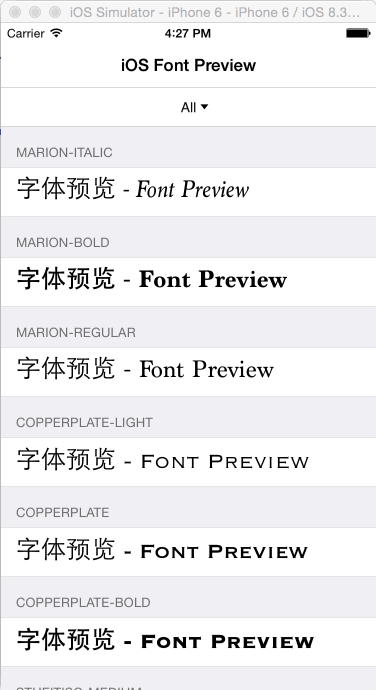

# iOSFontPreview

###Preview all the family fonts which installed in current iOS system.

======

Just download/clone the project and run it in the device/simulator.

 

Family - Font Name
---
 
*Results that run in iOS 8.4 Simulator*

* Marion
    1.  Marion-Italic
    2.  Marion-Bold
    3.  Marion-Regular
* Copperplate
    1.  Copperplate-Light
    2.  Copperplate
    3.  Copperplate-Bold
* Heiti SC
    1.  STHeitiSC-Medium
    2.  STHeitiSC-Light
* Iowan Old Style
    1.  IowanOldStyle-Italic
    2.  IowanOldStyle-Roman
    3.  IowanOldStyle-BoldItalic
    4.  IowanOldStyle-Bold
* Courier New
    1.  CourierNewPS-BoldMT
    2.  CourierNewPS-ItalicMT
    3.  CourierNewPSMT
    4.  CourierNewPS-BoldItalicMT
* Apple SD Gothic Neo
    1.  AppleSDGothicNeo-Bold
    2.  AppleSDGothicNeo-Thin
    3.  AppleSDGothicNeo-UltraLight
    4.  AppleSDGothicNeo-Regular
    5.  AppleSDGothicNeo-Light
    6.  AppleSDGothicNeo-Medium
    7.  AppleSDGothicNeo-SemiBold
* Heiti TC
    1.  STHeitiTC-Medium
    2.  STHeitiTC-Light
* Gill Sans
    1.  GillSans-Italic
    2.  GillSans-Bold
    3.  GillSans-BoldItalic
    4.  GillSans-LightItalic
    5.  GillSans
    6.  GillSans-Light
    7.  GillSans-SemiBold
    8.  GillSans-SemiBoldItalic
    9.  GillSans-UltraBold
* Marker Felt
    1.  MarkerFelt-Thin
    2.  MarkerFelt-Wide
* Thonburi
    1.  Thonburi
    2.  Thonburi-Bold
    3.  Thonburi-Light
* Avenir Next Condensed
    1.  AvenirNextCondensed-BoldItalic
    2.  AvenirNextCondensed-Heavy
    3.  AvenirNextCondensed-Medium
    4.  AvenirNextCondensed-Regular
    5.  AvenirNextCondensed-HeavyItalic
    6.  AvenirNextCondensed-MediumItalic
    7.  AvenirNextCondensed-Italic
    8.  AvenirNextCondensed-UltraLightItalic
    9.  AvenirNextCondensed-DemiBold
    10.  AvenirNextCondensed-UltraLight
    11.  AvenirNextCondensed-Bold
    12.  AvenirNextCondensed-DemiBoldItalic
* Tamil Sangam MN
    1.  TamilSangamMN
    2.  TamilSangamMN-Bold
* Helvetica Neue
    1.  HelveticaNeue-Italic
    2.  HelveticaNeue-Bold
    3.  HelveticaNeue-UltraLight
    4.  HelveticaNeue-CondensedBlack
    5.  HelveticaNeue-BoldItalic
    6.  HelveticaNeue-CondensedBold
    7.  HelveticaNeue-Medium
    8.  HelveticaNeue-Light
    9.  HelveticaNeue-Thin
    10.  HelveticaNeue-ThinItalic
    11.  HelveticaNeue-LightItalic
    12.  HelveticaNeue-UltraLightItalic
    13.  HelveticaNeue-MediumItalic
    14.  HelveticaNeue
* Gurmukhi MN
    1.  GurmukhiMN-Bold
    2.  GurmukhiMN
* Times New Roman
    1.  TimesNewRomanPSMT
    2.  TimesNewRomanPS-BoldItalicMT
    3.  TimesNewRomanPS-ItalicMT
    4.  TimesNewRomanPS-BoldMT
* Georgia
    1.  Georgia-BoldItalic
    2.  Georgia
    3.  Georgia-Italic
    4.  Georgia-Bold
* Apple Color Emoji
    1.  AppleColorEmoji
* Arial Rounded MT Bold
    1.  ArialRoundedMTBold
* Kailasa
    1.  Kailasa-Bold
    2.  Kailasa
* Kohinoor Devanagari
    1.  KohinoorDevanagari-Light
    2.  KohinoorDevanagari-Medium
    3.  KohinoorDevanagari-Book
* Sinhala Sangam MN
    1.  SinhalaSangamMN-Bold
    2.  SinhalaSangamMN
* Chalkboard SE
    1.  ChalkboardSE-Bold
    2.  ChalkboardSE-Light
    3.  ChalkboardSE-Regular
* Superclarendon
    1.  Superclarendon-Italic
    2.  Superclarendon-Black
    3.  Superclarendon-LightItalic
    4.  Superclarendon-BlackItalic
    5.  Superclarendon-BoldItalic
    6.  Superclarendon-Light
    7.  Superclarendon-Regular
    8.  Superclarendon-Bold
* Gujarati Sangam MN
    1.  GujaratiSangamMN-Bold
    2.  GujaratiSangamMN
* Damascus
    1.  DamascusLight
    2.  DamascusBold
    3.  DamascusSemiBold
    4.  DamascusMedium
    5.  Damascus
* Noteworthy
    1.  Noteworthy-Light
    2.  Noteworthy-Bold
* Geeza Pro
    1.  GeezaPro
    2.  GeezaPro-Bold
* Avenir
    1.  Avenir-Medium
    2.  Avenir-HeavyOblique
    3.  Avenir-Book
    4.  Avenir-Light
    5.  Avenir-Roman
    6.  Avenir-BookOblique
    7.  Avenir-Black
    8.  Avenir-MediumOblique
    9.  Avenir-BlackOblique
    10.  Avenir-Heavy
    11.  Avenir-LightOblique
    12.  Avenir-Oblique
* Academy Engraved LET
    1.  AcademyEngravedLetPlain
* Mishafi
    1.  DiwanMishafi
* Futura
    1.  Futura-CondensedMedium
    2.  Futura-CondensedExtraBold
    3.  Futura-Medium
    4.  Futura-MediumItalic
* Farah
    1.  Farah
* Kannada Sangam MN
    1.  KannadaSangamMN
    2.  KannadaSangamMN-Bold
* Arial Hebrew
    1.  ArialHebrew-Bold
    2.  ArialHebrew-Light
    3.  ArialHebrew
* Arial
    1.  ArialMT
    2.  Arial-BoldItalicMT
    3.  Arial-BoldMT
    4.  Arial-ItalicMT
* Party LET
    1.  PartyLetPlain
* Chalkduster
    1.  Chalkduster
* Hiragino Kaku Gothic ProN
    1.  HiraKakuProN-W6
    2.  HiraKakuProN-W3
* Hoefler Text
    1.  HoeflerText-Italic
    2.  HoeflerText-Regular
    3.  HoeflerText-Black
    4.  HoeflerText-BlackItalic
* Optima
    1.  Optima-Regular
    2.  Optima-ExtraBlack
    3.  Optima-BoldItalic
    4.  Optima-Italic
    5.  Optima-Bold
* Palatino
    1.  Palatino-Bold
    2.  Palatino-Roman
    3.  Palatino-BoldItalic
    4.  Palatino-Italic
* Malayalam Sangam MN
    1.  MalayalamSangamMN-Bold
    2.  MalayalamSangamMN
* Lao Sangam MN
    1.  LaoSangamMN
* Al Nile
    1.  AlNile-Bold
    2.  AlNile
* Bradley Hand
    1.  BradleyHandITCTT-Bold
* Hiragino Mincho ProN
    1.  HiraMinProN-W6
    2.  HiraMinProN-W3
* Trebuchet MS
    1.  Trebuchet-BoldItalic
    2.  TrebuchetMS
    3.  TrebuchetMS-Bold
    4.  TrebuchetMS-Italic
* Helvetica
    1.  Helvetica-Bold
    2.  Helvetica
    3.  Helvetica-LightOblique
    4.  Helvetica-Oblique
    5.  Helvetica-BoldOblique
    6.  Helvetica-Light
* Courier
    1.  Courier-BoldOblique
    2.  Courier
    3.  Courier-Bold
    4.  Courier-Oblique
* Cochin
    1.  Cochin-Bold
    2.  Cochin
    3.  Cochin-Italic
    4.  Cochin-BoldItalic
* Devanagari Sangam MN
    1.  DevanagariSangamMN
    2.  DevanagariSangamMN-Bold
* Oriya Sangam MN
    1.  OriyaSangamMN
    2.  OriyaSangamMN-Bold
* Snell Roundhand
    1.  SnellRoundhand-Bold
    2.  SnellRoundhand
    3.  SnellRoundhand-Black
* Zapf Dingbats
    1.  ZapfDingbatsITC
* Bodoni 72
    1.  BodoniSvtyTwoITCTT-Bold
    2.  BodoniSvtyTwoITCTT-Book
    3.  BodoniSvtyTwoITCTT-BookIta
* Verdana
    1.  Verdana-Italic
    2.  Verdana-BoldItalic
    3.  Verdana
    4.  Verdana-Bold
* American Typewriter
    1.  AmericanTypewriter-CondensedLight
    2.  AmericanTypewriter
    3.  AmericanTypewriter-CondensedBold
    4.  AmericanTypewriter-Light
    5.  AmericanTypewriter-Bold
    6.  AmericanTypewriter-Condensed
* Avenir Next
    1.  AvenirNext-UltraLight
    2.  AvenirNext-UltraLightItalic
    3.  AvenirNext-Bold
    4.  AvenirNext-BoldItalic
    5.  AvenirNext-DemiBold
    6.  AvenirNext-DemiBoldItalic
    7.  AvenirNext-Medium
    8.  AvenirNext-HeavyItalic
    9.  AvenirNext-Heavy
    10.  AvenirNext-Italic
    11.  AvenirNext-Regular
    12.  AvenirNext-MediumItalic
* Baskerville
    1.  Baskerville-Italic
    2.  Baskerville-SemiBold
    3.  Baskerville-BoldItalic
    4.  Baskerville-SemiBoldItalic
    5.  Baskerville-Bold
    6.  Baskerville
* Khmer Sangam MN
    1.  KhmerSangamMN
* Didot
    1.  Didot-Italic
    2.  Didot-Bold
    3.  Didot
* Savoye LET
    1.  SavoyeLetPlain
* Bodoni Ornaments
    1.  BodoniOrnamentsITCTT
* Symbol
    1.  Symbol
* Menlo
    1.  Menlo-Italic
    2.  Menlo-Bold
    3.  Menlo-Regular
    4.  Menlo-BoldItalic
* Bodoni 72 Smallcaps
    1.  BodoniSvtyTwoSCITCTT-Book
* DIN Alternate
    1.  DINAlternate-Bold
* Papyrus
    1.  Papyrus
    2.  Papyrus-Condensed
* Euphemia UCAS
    1.  EuphemiaUCAS-Italic
    2.  EuphemiaUCAS
    3.  EuphemiaUCAS-Bold
* Telugu Sangam MN
    1.  TeluguSangamMN
    2.  TeluguSangamMN-Bold
* Bangla Sangam MN
    1.  BanglaSangamMN-Bold
    2.  BanglaSangamMN
* Zapfino
    1.  Zapfino
* Bodoni 72 Oldstyle
    1.  BodoniSvtyTwoOSITCTT-Book
    2.  BodoniSvtyTwoOSITCTT-Bold
    3.  BodoniSvtyTwoOSITCTT-BookIt
* DIN Condensed
    1.  DINCondensed-Bold

